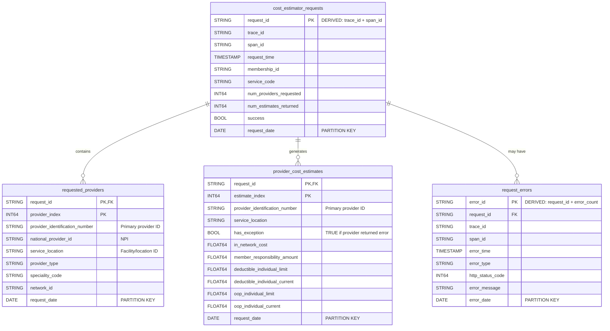

# BigQuery Data Model Design - Cost Estimator Analytics

**Purpose**: Dimensional data model for analyzing OpenTelemetry trace data from the Cost Estimator service.

**Source Data**: OpenTelemetry traces (JSON format) from `cost_estimation_endpoint` spans.

**Analytics Focus**:
- Member request patterns and behavior
- Service usage analysis
- Provider request/response analytics
- Cost estimate breakdowns with accumulators
- Error and exception tracking

---

## Entity Relationship Diagram (ERD)



---

## Table Relationships

### 1. `cost_estimator_requests` → `requested_providers`

**Relationship Type**: One-to-Many (1:N)

**Description**: Each request contains multiple providers in the request body.

**Join Condition**:
```sql
requested_providers.request_id = cost_estimator_requests.request_id
```

**Cardinality**:
- 1 request can have 1 to many providers (typically 1-5)
- Each requested provider belongs to exactly 1 request

**Business Meaning**: 
- A member can request cost estimates for multiple providers in a single API call
- Each provider in the request is stored as a separate row for granular analysis

---

### 2. `cost_estimator_requests` → `provider_cost_estimates`

**Relationship Type**: One-to-Many (1:N)

**Description**: Each successful request generates cost estimates for providers.

**Join Condition**:
```sql
provider_cost_estimates.request_id = cost_estimator_requests.request_id
```

**Cardinality**:
- 1 request can generate 0 to many cost estimates
- 0 if request failed
- N if request succeeded (where N ≤ number of requested providers)
- Some providers may return exceptions instead of estimates

**Business Meaning**:
- Response contains cost breakdown for each provider that successfully processed the request
- Providers that encounter errors still get an entry with `has_exception = TRUE`

---

### 3. `cost_estimator_requests` → `request_errors`

**Relationship Type**: One-to-Many (1:M)

**Description**: Each request can have multiple errors across different spans in the trace.

**Join Condition**:
```sql
request_errors.request_id = cost_estimator_requests.request_id
```

**Cardinality**:
- 1 request can have 0 to many errors
- Multiple errors can occur at different levels (main request, OAuth, Benefits API, etc.)

**Business Meaning**:
- Tracks all failures within a request's execution path
- Enables root cause analysis across multiple system components

---

### 4. `requested_providers` ↔ `provider_cost_estimates`

**Relationship Type**: One-to-Zero-or-One (1:0..1)

**Description**: Each requested provider may or may not return a cost estimate.

**Join Condition**:
```sql
ON requested_providers.request_id = provider_cost_estimates.request_id
   AND COALESCE(requested_providers.provider_identification_number, 
                requested_providers.service_location) = 
       COALESCE(provider_cost_estimates.provider_identification_number, 
                provider_cost_estimates.service_location)
```

**Cardinality**:
- 1 requested provider → 0 or 1 cost estimate
- 0 if provider didn't respond or request failed
- 1 if provider returned estimate (or exception)

**Business Meaning**:
- Enables finding which providers failed to return estimates
- `LEFT JOIN` shows requested providers with missing responses

---

## Table Granularity

### `cost_estimator_requests`

**Grain**: One row per cost estimation request (one row per API call)

**Unique Key**: `request_id` (derived from `trace_id + span_id`)

**What it represents**:
- A single API call to `/costestimator/v1/rate`
- Contains request-level metadata, timing, and overall success/failure status

**Typical Row Count**: ~1M-10M rows/month (depends on API traffic)

**Aggregation Level**: Request-level aggregation (not span-level)

---

### `requested_providers`

**Grain**: One row per provider per request

**Unique Key**: `(request_id, provider_index)`

**What it represents**:
- Each provider specified in the request body's `providerInfo[]` array
- Denormalized with request context for easy query performance

**Typical Row Count**: 
- ~3-5x the number of requests (average 3-5 providers per request)
- If 1M requests → ~3-5M rows

**Aggregation Level**: Provider-request level

**Example**:
```
Request A with 3 providers → 3 rows in this table
  - (request_A, provider_index: 0)
  - (request_A, provider_index: 1)
  - (request_A, provider_index: 2)
```

---

### `provider_cost_estimates`

**Grain**: One row per provider cost estimate in the response

**Unique Key**: `(request_id, estimate_index)`

**What it represents**:
- Each provider's cost breakdown from `costEstimateResponseInfo[]` array
- Includes successful estimates AND providers that returned exceptions
- Contains parsed accumulator data (deductibles, OOP max)

**Typical Row Count**:
- Similar to `requested_providers` if all providers respond
- Could be less if some providers don't respond or request fails
- ~2-4x the number of requests

**Aggregation Level**: Provider-response level

**Special Cases**:
- If `has_exception = TRUE`: cost fields are NULL, exception fields populated
- If `has_exception = FALSE`: cost fields populated, exception fields NULL

**Example**:
```
Request A with 5 providers requested:
  - 4 providers return estimates → 4 rows with has_exception = FALSE
  - 1 provider returns error → 1 row with has_exception = TRUE
  - Total: 5 rows in this table
```

---

### `request_errors`

**Grain**: One row per error/exception occurrence

**Unique Key**: `error_id` (derived from `request_id + error_count`)

**What it represents**:
- Individual errors across all spans in the trace
- Captures HTTP errors, span errors, and exceptions at any level

**Typical Row Count**:
- Depends on error rate
- If 5% error rate and 2 errors per failed request: ~0.1x requests
- If 1M requests → ~100K error rows

**Aggregation Level**: Error-occurrence level

**Example**:
```
Request A fails with multiple errors → Multiple rows
  - HTTP 400 on main endpoint → 1 error row
  - HTTP 500 from Benefits API → 1 error row
  - Total: 2 rows for 1 failed request
```

---

## Data Partitioning & Clustering Strategy

### Partitioning

All tables partitioned by **DATE** for query performance and cost optimization:

| Table | Partition Column | Strategy |
|-------|------------------|----------|
| `cost_estimator_requests` | `request_date` | Daily |
| `requested_providers` | `request_date` | Daily |
| `provider_cost_estimates` | `request_date` | Daily |
| `request_errors` | `error_date` | Daily |

**Benefits**:
- Queries with date filters scan only relevant partitions
- Old data can be deleted by dropping partitions
- Cost savings on large datasets

---

### Clustering

Optimized for common query patterns:

| Table | Clustering Columns | Rationale |
|-------|-------------------|-----------|
| `cost_estimator_requests` | `membership_id`, `service_code`, `request_time`, `deployment_environment` | Member + service queries, time-series analysis |
| `requested_providers` | `provider_identification_number`, `service_location`, `membership_id`, `request_time` | Provider lookups, member-provider patterns |
| `provider_cost_estimates` | `provider_identification_number`, `service_location`, `membership_id`, `request_time` | Provider cost analysis, member costs |
| `request_errors` | `error_type`, `deployment_environment`, `error_time`, `membership_id` | Error analysis by type and environment |

**Benefits**:
- Columns are sorted and colocated
- Range filters and equality filters are extremely fast
- Significant cost savings on filtered queries

---

## Key Design Decisions

### 1. Provider Matching Strategy

**Challenge**: Match requested providers with returned estimates

**Solution**: Use `providerIdentificationNumber` as primary key, fallback to `service_location`

```sql
COALESCE(provider_identification_number, service_location)
```

**Rationale**:
- `providerIdentificationNumber` is the true provider ID (when present)
- `service_location` is always present as fallback
- `COALESCE` ensures robust matching

---

### 2. Derived Keys

**`request_id`**: Synthetic key created during ETL

```python
request_id = f"{trace_id}_{span_id}"
```

**Rationale**:
- Traces have `traceId` and `spanId` separately
- Need a single unique identifier for joins
- Composite key is easier than multi-column joins

**`error_id`**: Synthetic key for unique error identification

```python
error_id = f"{request_id}_error_{error_count}"
```

---

### 3. Denormalization

**Approach**: Denormalize common fields across tables

**Examples**:
- `membership_id` appears in all tables
- `service_code` appears in multiple tables
- Request context duplicated in `requested_providers` and `provider_cost_estimates`

**Rationale**:
- Eliminates need for joins in many queries
- Better query performance
- Simpler SQL for analysts
- Storage is cheap, compute is expensive in BigQuery

---

### 4. Response Body Extraction

**Source**: Extract from `events[name='response.body.full']`, not from truncated `attributes`

**Rationale**:
- Attributes limit response body to 2,048 characters (often truncated)
- Events contain complete response with all provider estimates
- Ensures data completeness

---

### 5. Exception Handling

**Approach**: Store provider exceptions as rows with `has_exception = TRUE`

**Rationale**:
- Preserves all provider responses (success or failure)
- Enables analysis of which providers frequently fail
- Maintains consistent row count matching requested providers

---

## Summary Statistics

| Metric | Estimated Value | Notes |
|--------|----------------|-------|
| **Requests per day** | 50K - 500K | Depends on API traffic |
| **Providers per request** | 3-5 average | Can be 1-10 |
| **Total tables** | 4 | Fact + dimension tables |
| **Storage growth** | ~10-50 GB/month | Depends on volume |
| **Query cost** | Low | With partitioning + clustering |
| **Data retention** | 90-365 days | Configurable |

---

## Analytics Use Cases Supported

✅ **Member Analysis**
- Which members make the most requests?
- What services do specific members request?
- Member journey and request patterns

✅ **Service Analysis**
- Most requested service codes
- Service request trends over time
- Service-specific cost patterns

✅ **Provider Analysis**
- Most requested providers
- Provider response rates
- Providers with highest error rates
- Cost variation across providers

✅ **Cost Analytics**
- Average costs by provider
- Member responsibility trends
- Accumulator (deductible/OOP) progression
- In-network vs out-of-network costs

✅ **Error Analysis**
- Error rates by type
- Members/services with most errors
- Infrastructure error patterns
- Root cause analysis
