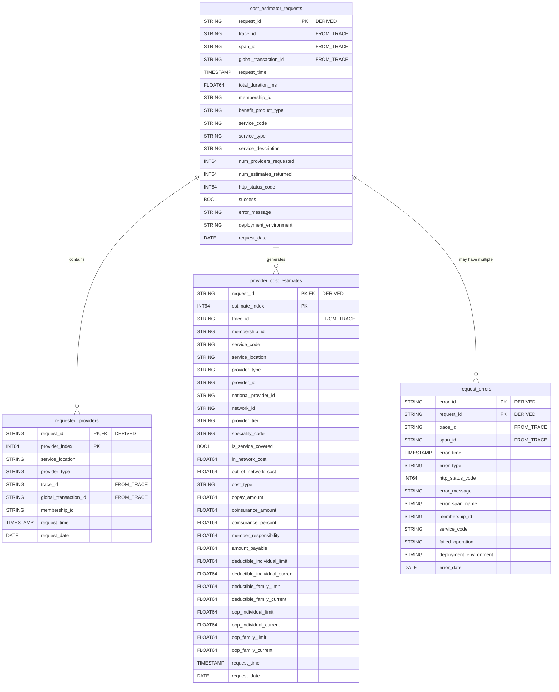

# BigQuery Data Model for Cost Estimator Analytics

## Overview

This data model is designed specifically for analyzing:
1. **Member behavior** - Which members request what services
2. **Service usage** - What services are most requested
3. **Provider analysis** - Which providers are requested and returned
4. **Cost estimates** - Provider rates and cost breakdowns
5. **Error tracking** - Request failures and exceptions

## Entity Relationship Diagram (ERD)



> [!IMPORTANT]
> **Field Annotations:**
> - **DERIVED**: Synthetic key created during ETL (not in source trace data)
> - **FROM_TRACE**: Field exists directly in the OpenTelemetry trace JSON

### Derived Keys Explanation

**`request_id`**: Synthesized during ETL as `{trace_id}_{span_id}` to create a unique identifier for each request. This is needed because:
- Your traces contain `traceId` and `spanId` (separate fields)
- A single `trace_id` can have multiple spans
- We need a composite key to uniquely identify the root request span

**Example:**
```python
request_id = f"{trace_data['traceId']}_{root_span['spanId']}"
# e.g., "e4a9f7ccb6f79ef898b7e488175c61be_fa43e1ea6e37eeed"
```

**`error_id`**: Synthesized as `{trace_id}_{error_span_id}_{timestamp}` to uniquely identify each error occurrence

### Table Relationships

**cost_estimator_requests → requested_providers**: 1:Many - Each request contains multiple providers in the request body (`providerInfo[]` array)

**cost_estimator_requests → provider_cost_estimates**: 1:Many - Each successful request generates cost estimates for multiple providers (`costEstimateResponseInfo[]` array)

**cost_estimator_requests → request_errors**: 1:Many - Each request can have **multiple errors**:
  - Main request-level errors (HTTP 400/500)
  - External OAuth API failures
  - Benefits API errors  
  - Accumulator API timeouts
  - Internal validation errors
  - Business logic exceptions

---

## Table Schemas

### Table 1: `cost_estimator_requests`

Main fact table for all cost estimation requests.

```sql
CREATE TABLE `project.dataset.cost_estimator_requests` (
  -- Identifiers
  request_id STRING NOT NULL,  -- Derived from trace_id + root span_id
  trace_id STRING NOT NULL,
  span_id STRING NOT NULL,
  global_transaction_id STRING,
  api_transaction_id STRING,
  
  -- Timing
  request_time TIMESTAMP NOT NULL,
  response_time TIMESTAMP,
  total_duration_ms FLOAT64,
  
  -- Member Information
  membership_id STRING,
  account_identifier STRING,
  user_level_of_assurance STRING,
  
  -- Service Information
  service_code STRING,
  service_type STRING,  -- CPT4, HCPCS, etc.
  service_description STRING,
  benefit_product_type STRING,  -- Medical, Dental, etc.
  
  -- Provider Counts
  num_providers_requested INT64,
  num_estimates_returned INT64,
  
  -- Request Status
  http_status_code INT64,
  status_code INT64,
  success BOOL,
  error_message STRING,
  
  -- Response Metadata
  response_truncated BOOL,
  response_type STRING,
  
  -- External API Calls Performance
  oauth_duration_ms FLOAT64,
  benefits_api_call_count INT64,
  benefits_api_total_duration_ms FLOAT64,
  accumulator_api_duration_ms FLOAT64,
  
  -- Infrastructure
  service_name STRING,
  deployment_environment STRING,
  k8s_cluster_name STRING,
  k8s_pod_ip STRING,
  cloud_availability_zone STRING,
  
  -- Raw Data (for deep dives)
  request_body_json STRING,
  response_body_json STRING,
  
  -- User Context
  user_roles ARRAY<STRING>,
  application_id STRING,
  
  -- HTTP Details
  http_method STRING,
  http_route STRING,
  http_url STRING,
  user_agent STRING,
  
  -- Metadata
  ingestion_timestamp TIMESTAMP,
  request_date DATE
)
PARTITION BY request_date
CLUSTER BY membership_id, service_code, request_time, deployment_environment;
```

### Table 2: `requested_providers`

One row per provider in each request (denormalized for easy analysis).

```sql
CREATE TABLE `project.dataset.requested_providers` (
  -- Request Reference
  request_id STRING NOT NULL,
  trace_id STRING NOT NULL,
  global_transaction_id STRING,
  
  -- Provider Index
  provider_index INT64 NOT NULL,  -- Position in providerInfo array (0-based)
  
  -- Request Context (denormalized)
  request_time TIMESTAMP NOT NULL,
  membership_id STRING,
  service_code STRING,
  benefit_product_type STRING,
  
  -- Provider Identifiers (from Request)
  provider_identification_number STRING,  -- Primary provider ID
  national_provider_id STRING,  -- NPI
  service_location STRING,  -- Facility/location ID
  provider_type STRING,
  
  -- Additional Provider Info
  speciality_code STRING,
  network_id STRING,
  tax_id STRING,
  tax_id_qualifier STRING,
  
  -- Metadata
  deployment_environment STRING,
  request_date DATE
)
PARTITION BY request_date
CLUSTER BY provider_identification_number, service_location, membership_id, request_time;
```

### Table 3: `provider_cost_estimates`

One row per provider cost estimate in the response (parsed from `events.response.body.full`).

> [!NOTE]
> **Handling Provider Exceptions**: Some providers may return exceptions instead of cost estimates. These are still inserted as rows with `has_exception = TRUE` and exception details populated.

```sql
CREATE TABLE `project.dataset.provider_cost_estimates` (\n  -- Request Reference
  request_id STRING NOT NULL,
  trace_id STRING NOT NULL,
  estimate_index INT64 NOT NULL,  -- Position in costEstimateResponseInfo array
  
  -- Request Context (denormalized for query performance)
  request_time TIMESTAMP NOT NULL,
  membership_id STRING,
  service_code STRING,
  service_type STRING,
  benefit_product_type STRING,
  
  -- Provider Identifiers
  provider_identification_number STRING,  -- Primary provider ID
  national_provider_id STRING,
  service_location STRING,  -- Facility/location ID
  provider_type STRING,
  tax_id STRING,
  tax_id_qualifier STRING,
  speciality_code STRING,
  
  -- Network Information
  network_id STRING,
  provider_tier STRING,
  
  -- Exception Handling (for providers that return errors)
  has_exception BOOL,  -- TRUE if this provider returned an exception
  exception_type STRING,
  exception_title STRING,
  exception_status INT64,
  exception_detail STRING,
  exception_message STRING,
  exception_correlation_id STRING,
  
  -- Coverage (NULL if has_exception = TRUE)
  is_service_covered STRING,  -- Y/N
  max_coverage_amount FLOAT64,
  
  -- Costs (NULL if has_exception = TRUE)
  in_network_cost FLOAT64,
  out_of_network_cost FLOAT64,
  in_network_cost_type STRING,  -- AMOUNT vs PERCENTAGE
  
  -- Cost Share
  copay_amount FLOAT64,
  coinsurance_amount FLOAT64,
  coinsurance_percent FLOAT64,
  
  -- Member Responsibility
  member_responsibility_amount FLOAT64,
  member_responsibility_percent FLOAT64,
  amount_payable FLOAT64,
  
  -- Deductible Information (Individual)
  deductible_individual_limit FLOAT64,
  deductible_individual_current FLOAT64,
  deductible_individual_calculated FLOAT64,  -- = limit - current
  deductible_individual_remaining FLOAT64,   -- From accumulatorCalculation
  deductible_individual_applied FLOAT64,     -- From accumulatorCalculation
  
  -- Deductible Information (Family)
  deductible_family_limit FLOAT64,
  deductible_family_current FLOAT64,
  deductible_family_calculated FLOAT64,
  deductible_family_remaining FLOAT64,
  deductible_family_applied FLOAT64,
  
  -- Out of Pocket Maximum (Individual)
  oop_individual_limit FLOAT64,
  oop_individual_current FLOAT64,
  oop_individual_calculated FLOAT64,
  oop_individual_remaining FLOAT64,
  oop_individual_applied FLOAT64,
  
  -- Out of Pocket Maximum (Family)
  oop_family_limit FLOAT64,
  oop_family_current FLOAT64,
  oop_family_calculated FLOAT64,
  oop_family_remaining FLOAT64,
  oop_family_applied FLOAT64,
  
  -- Metadata
  deployment_environment STRING,
  request_date DATE
)
PARTITION BY request_date
CLUSTER BY provider_identification_number, service_location, membership_id, request_time;
```

### Table 4: `request_errors`

Dedicated table for tracking errors and exceptions.

```sql
CREATE TABLE `project.dataset.request_errors` (
  -- Error Identification
  error_id STRING NOT NULL,  -- UUID or trace_id + error_timestamp
  request_id STRING,
  trace_id STRING NOT NULL,
  span_id STRING,
  
  -- Timing
  error_time TIMESTAMP NOT NULL,
  request_duration_before_error_ms FLOAT64,
  
  -- Error Classification
  error_type STRING,  -- HTTP_ERROR, VALIDATION_ERROR, SYSTEM_ERROR, TIMEOUT, etc.
  error_severity STRING,  -- CRITICAL, ERROR, WARNING
  
  -- Error Details
  http_status_code INT64,
  status_code INT64,
  error_message STRING,
  error_span_name STRING,
  failed_operation STRING,
  
  -- Request Context (denormalized for analysis)
  membership_id STRING,
  service_code STRING,
  benefit_product_type STRING,
  num_providers_requested INT64,
  
  -- HTTP Context
  http_method STRING,
  http_route STRING,
  http_url STRING,
  
  -- Infrastructure
  service_name STRING,
  deployment_environment STRING,
  k8s_cluster_name STRING,
  k8s_pod_ip STRING,
  
  -- Related Entities
  external_api_url STRING,  -- If error from external API call
  external_api_status_code INT64,
  
  -- Raw Data
  request_body_json STRING,
  
  -- Metadata
  ingestion_timestamp TIMESTAMP,
  error_date DATE
)
PARTITION BY error_date
CLUSTER BY error_type, deployment_environment, error_time, membership_id;
```

---

## Sample Analytics Queries

### 1. Member Request Analysis - Most Active Members

```sql
-- Which members are making the most requests?
SELECT 
  membership_id,
  COUNT(*) as total_requests,
  COUNT(DISTINCT service_code) as unique_services_requested,
  COUNT(DISTINCT DATE(request_time)) as active_days,
  ROUND(AVG(num_providers_requested), 1) as avg_providers_per_request,
  ROUND(100.0 * COUNTIF(success) / COUNT(*), 2) as success_rate_pct,
  ROUND(AVG(total_duration_ms), 2) as avg_response_time_ms,
  MIN(request_time) as first_request,
  MAX(request_time) as last_request
FROM `project.dataset.cost_estimator_requests`
WHERE request_date >= DATE_SUB(CURRENT_DATE(), INTERVAL 30 DAY)
  AND membership_id IS NOT NULL
GROUP BY membership_id
ORDER BY total_requests DESC
LIMIT 100;
```

### 2. Service Request Analysis - Most Requested Services

```sql
-- What are the most requested service codes?
SELECT 
  service_code,
  service_type,
  benefit_product_type,
  COUNT(*) as request_count,
  COUNT(DISTINCT membership_id) as unique_members,
  ROUND(AVG(num_providers_requested), 1) as avg_providers_requested,
  ROUND(AVG(num_estimates_returned), 1) as avg_estimates_returned,
  ROUND(100.0 * COUNTIF(success) / COUNT(*), 2) as success_rate_pct,
  ROUND(AVG(total_duration_ms), 2) as avg_response_time_ms,
  ROUND(APPROX_QUANTILES(total_duration_ms, 100)[OFFSET(95)], 2) as p95_response_time_ms
FROM `project.dataset.cost_estimator_requests`
WHERE request_date >= DATE_SUB(CURRENT_DATE(), INTERVAL 30 DAY)
GROUP BY service_code, service_type, benefit_product_type
ORDER BY request_count DESC
LIMIT 50;
```

### 3. Provider Request Analysis - Most Requested Providers

```sql
-- Which providers are most frequently requested?
SELECT 
  rp.service_location,
  rp.provider_type,
  COUNT(*) as times_requested,
  COUNT(DISTINCT rp.membership_id) as unique_members,
  COUNT(DISTINCT rp.service_code) as unique_services,
  COUNT(DISTINCT rp.request_id) as unique_requests,
  
  -- Success rate for this provider
  ROUND(100.0 * COUNTIF(req.success) / COUNT(*), 2) as success_rate_pct,
  
  -- Average response time when this provider is requested
  ROUND(AVG(req.total_duration_ms), 2) as avg_response_time_ms
FROM `project.dataset.requested_providers` rp
JOIN `project.dataset.cost_estimator_requests` req 
  ON rp.request_id = req.request_id
WHERE rp.request_date >= DATE_SUB(CURRENT_DATE(), INTERVAL 30 DAY)
GROUP BY rp.service_location, rp.provider_type
ORDER BY times_requested DESC
LIMIT 100;
```

### 4. Provider Cost Estimates Analysis - Average Costs by Provider

```sql
-- What are the average costs by provider?
SELECT 
  service_location,
  provider_type,
  network_id,
  speciality_code,
  COUNT(*) as estimate_count,
  COUNT(DISTINCT membership_id) as unique_members,
  COUNT(DISTINCT service_code) as unique_services,
  
  -- Cost Statistics
  ROUND(AVG(in_network_cost), 2) as avg_in_network_cost,
  ROUND(APPROX_QUANTILES(in_network_cost, 100)[OFFSET(50)], 2) as median_in_network_cost,
  ROUND(MIN(in_network_cost), 2) as min_in_network_cost,
  ROUND(MAX(in_network_cost), 2) as max_in_network_cost,
  
  -- Member Cost Share
  ROUND(AVG(member_responsibility_amount), 2) as avg_member_responsibility,
  ROUND(AVG(copay_amount), 2) as avg_copay,
  ROUND(AVG(coinsurance_amount), 2) as avg_coinsurance,
  
  -- Coverage
  ROUND(100.0 * COUNTIF(is_service_covered = 'Y') / COUNT(*), 2) as coverage_rate_pct
FROM `project.dataset.provider_cost_estimates`
WHERE request_date >= DATE_SUB(CURRENT_DATE(), INTERVAL 30 DAY)
  AND in_network_cost IS NOT NULL
GROUP BY service_location, provider_type, network_id, speciality_code
ORDER BY estimate_count DESC
LIMIT 100;
```

### 5. Provider Cost Comparison - Same Service, Different Providers

```sql
-- Compare costs across providers for the same service
SELECT 
  service_code,
  service_location,
  provider_type,
  network_id,
  COUNT(*) as estimate_count,
  
  ROUND(AVG(in_network_cost), 2) as avg_cost,
  ROUND(MIN(in_network_cost), 2) as min_cost,
  ROUND(MAX(in_network_cost), 2) as max_cost,
  ROUND(STDDEV(in_network_cost), 2) as cost_stddev,
  
  ROUND(AVG(member_responsibility_amount), 2) as avg_member_pays,
  ROUND(AVG(amount_payable), 2) as avg_insurance_pays
FROM `project.dataset.provider_cost_estimates`
WHERE request_date >= DATE_SUB(CURRENT_DATE(), INTERVAL 30 DAY)
  AND service_code = '42420'  -- Replace with specific service
  AND in_network_cost > 0
GROUP BY service_code, service_location, provider_type, network_id
ORDER BY avg_cost ASC;
```

### 6. Error Analysis - Error Rates and Types

```sql
-- What are the most common errors?
SELECT 
  error_type,
  http_status_code,
  failed_operation,
  COUNT(*) as error_count,
  COUNT(DISTINCT membership_id) as affected_members,
  COUNT(DISTINCT service_code) as affected_services,
  
  ROUND(AVG(request_duration_before_error_ms), 2) as avg_duration_before_error_ms,
  
  -- Sample error messages
  ARRAY_AGG(DISTINCT error_message LIMIT 5) as sample_error_messages,
  
  MIN(error_time) as first_occurrence,
  MAX(error_time) as last_occurrence
FROM `project.dataset.request_errors`
WHERE error_date >= DATE_SUB(CURRENT_DATE(), INTERVAL 7 DAY)
GROUP BY error_type, http_status_code, failed_operation
ORDER BY error_count DESC;
```

### 7. Error Analysis - Members with Most Errors

```sql
-- Which members are experiencing the most errors?
SELECT 
  e.membership_id,
  COUNT(*) as error_count,
  COUNT(DISTINCT e.service_code) as services_with_errors,
  ARRAY_AGG(DISTINCT e.error_type LIMIT 5) as error_types,
  
  -- Total requests for context
  COUNT(DISTINCT r.request_id) as total_requests,
  ROUND(100.0 * COUNT(*) / COUNT(DISTINCT r.request_id), 2) as error_rate_pct,
  
  MAX(e.error_time) as last_error_time
FROM `project.dataset.request_errors` e
LEFT JOIN `project.dataset.cost_estimator_requests` r 
  ON e.membership_id = r.membership_id
  AND r.request_date >= DATE_SUB(CURRENT_DATE(), INTERVAL 7 DAY)
WHERE e.error_date >= DATE_SUB(CURRENT_DATE(), INTERVAL 7 DAY)
GROUP BY e.membership_id
ORDER BY error_count DESC
LIMIT 100;
```

### 8. Provider Performance - Success Rate by Provider

```sql
-- Which providers have the best/worst success rates?
WITH provider_requests AS (
  SELECT 
    rp.service_location,
    rp.provider_type,
    COUNT(*) as times_requested,
    COUNTIF(req.success) as successful_requests,
    ROUND(100.0 * COUNTIF(req.success) / COUNT(*), 2) as success_rate_pct,
    ROUND(AVG(req.total_duration_ms), 2) as avg_response_time_ms
  FROM `project.dataset.requested_providers` rp
  JOIN `project.dataset.cost_estimator_requests` req 
    ON rp.request_id = req.request_id
  WHERE rp.request_date >= DATE_SUB(CURRENT_DATE(), INTERVAL 30 DAY)
  GROUP BY rp.service_location, rp.provider_type
  HAVING times_requested >= 10  -- Minimum threshold for statistical significance
)
SELECT *
FROM provider_requests
ORDER BY success_rate_pct ASC, times_requested DESC
LIMIT 50;
```

### 9. Member Service Journey - Request Pattern Analysis

```sql
-- Analyze a specific member's request patterns
SELECT 
  r.request_time,
  r.service_code,
  r.benefit_product_type,
  r.num_providers_requested,
  r.num_estimates_returned,
  r.success,
  r.total_duration_ms,
  r.http_status_code,
  r.error_message,
  
  -- Providers requested
  ARRAY(
    SELECT service_location 
    FROM `project.dataset.requested_providers` rp 
    WHERE rp.request_id = r.request_id
    ORDER BY provider_index
  ) as requested_providers,
  
  -- Cost range if successful
  (
    SELECT ROUND(AVG(in_network_cost), 2)
    FROM `project.dataset.provider_cost_estimates` pce
    WHERE pce.request_id = r.request_id
  ) as avg_estimated_cost
FROM `project.dataset.cost_estimator_requests` r
WHERE r.membership_id = '5~266294542+11+2+20250101+892005+AA+101'  -- Replace with specific member
  AND r.request_date >= DATE_SUB(CURRENT_DATE(), INTERVAL 90 DAY)
ORDER BY r.request_time DESC;
```

### 10. Daily Trends - Requests, Success Rate, Errors

```sql
-- Daily trends for monitoring
SELECT 
  request_date,
  COUNT(*) as total_requests,
  COUNT(DISTINCT membership_id) as unique_members,
  COUNT(DISTINCT service_code) as unique_services,
  
  COUNTIF(success) as successful_requests,
  COUNTIF(NOT success) as failed_requests,
  ROUND(100.0 * COUNTIF(success) / COUNT(*), 2) as success_rate_pct,
  
  ROUND(AVG(total_duration_ms), 2) as avg_response_time_ms,
  ROUND(APPROX_QUANTILES(total_duration_ms, 100)[OFFSET(95)], 2) as p95_response_time_ms,
  
  -- Error breakdown
  (SELECT COUNT(*) 
   FROM `project.dataset.request_errors` e 
   WHERE e.error_date = r.request_date) as error_count
FROM `project.dataset.cost_estimator_requests` r
WHERE request_date >= DATE_SUB(CURRENT_DATE(), INTERVAL 30 DAY)
GROUP BY request_date
ORDER BY request_date DESC;
```

### 11. Missing Provider Estimates - Find Providers Who Didn't Respond

```sql
-- Find providers who were requested but didn't return estimates (or returned exceptions)
SELECT 
  rp.request_id,
  rp.trace_id,
  rp.membership_id,
  rp.service_code,
  rp.request_time,
  
  -- Requested provider details
  rp.provider_identification_number as requested_provider_id,
  rp.national_provider_id as requested_npi,
  rp.service_location as requested_location,
  rp.provider_type as requested_type,
  
  -- Status
  CASE 
    WHEN pce.estimate_index IS NULL THEN 'NO_RESPONSE'
    WHEN pce.has_exception THEN CONCAT('EXCEPTION: ', pce.exception_title)
    ELSE 'SUCCESS'
  END as provider_status,
  
  -- Exception details if applicable
  pce.exception_detail,
  pce.exception_message
  
FROM `project.dataset.requested_providers` rp
LEFT JOIN `project.dataset.provider_cost_estimates` pce
  ON rp.request_id = pce.request_id
  AND COALESCE(rp.provider_identification_number, rp.service_location) = 
      COALESCE(pce.provider_identification_number, pce.service_location)
  
WHERE rp.request_date >= DATE_SUB(CURRENT_DATE(), INTERVAL 7 DAY)
  AND (pce.estimate_index IS NULL OR pce.has_exception = TRUE)
ORDER BY rp.request_time DESC
LIMIT 1000;
```

### 12. Provider Response Rate Analysis

```sql
-- Analyze which providers fail to return estimates most frequently
SELECT 
  COALESCE(rp.provider_identification_number, rp.service_location) as provider_id,
  rp.provider_type,
  rp.speciality_code,
  
  COUNT(DISTINCT rp.request_id) as times_requested,
  COUNT(DISTINCT CASE WHEN pce.estimate_index IS NOT NULL AND pce.has_exception = FALSE THEN rp.request_id END) as times_successful,
  COUNT(DISTINCT CASE WHEN pce.has_exception = TRUE THEN rp.request_id END) as times_exception,
  COUNT(DISTINCT CASE WHEN pce.estimate_index IS NULL THEN rp.request_id END) as times_no_response,
  
  ROUND(100.0 * COUNT(DISTINCT CASE WHEN pce.estimate_index IS NOT NULL AND pce.has_exception = FALSE THEN rp.request_id END) 
        / COUNT(DISTINCT rp.request_id), 2) as success_rate_pct,
  
  -- Most common exception
  ARRAY_AGG(DISTINCT pce.exception_title IGNORE NULLS LIMIT 3) as common_exceptions
  
FROM `project.dataset.requested_providers` rp
LEFT JOIN `project.dataset.provider_cost_estimates` pce
  ON rp.request_id = pce.request_id
  AND COALESCE(rp.provider_identification_number, rp.service_location) = 
      COALESCE(pce.provider_identification_number, pce.service_location)
      
WHERE rp.request_date >= DATE_SUB(CURRENT_DATE(), INTERVAL 30 DAY)
GROUP BY 1, 2, 3
HAVING times_requested >= 10  -- Minimum threshold
ORDER BY success_rate_pct ASC, times_requested DESC
LIMIT 100;
```

---

### ETL Process Overview

> [!NOTE]
> **Key Insight: Multiple Errors Per Request**
> 
> A single request can generate multiple error records because different spans within the same trace can fail:
> - Root span fails (HTTP 400 validation error)
> - OAuth API call fails (HTTP 401)
> - Benefits API times out (HTTP 504)
> - Accumulator API returns error (HTTP 500)

```python
def parse_and_load_trace(trace_json):
    """Parse OpenTelemetry trace and load to BigQuery tables"""
    
    # Find root span (cost_estimation_endpoint)
    root_span = find_root_span(trace_json)
    if not root_span:
        return
    
    # Create derived request_id from trace fields
    request_id = f"{root_span['traceId']}_{root_span['spanId']}"
    
    # 1. Parse and insert main request
    request_row = {
        'request_id': request_id,  # DERIVED
        'trace_id': root_span['traceId'],  # FROM TRACE
        'span_id': root_span['spanId'],  # FROM TRACE
        'request_time': parse_timestamp(root_span['startTimeUnixNano']),
        'membership_id': extract_attribute(root_span, 'request.membership_id'),
        'service_code': extract_attribute(root_span, 'request.service_code'),
        'benefit_product_type': extract_attribute(root_span, 'request.benefit_product_type'),
        'num_providers_requested': extract_attribute(root_span, 'request.num_providers'),
        'http_status_code': extract_attribute(root_span, 'http.status_code'),
        'success': extract_attribute(root_span, 'http.status_code') == 200,
        'global_transaction_id': extract_attribute(root_span, 'x.global.transaction.id'),
        # ... more fields
    }
    insert_to_bq('cost_estimator_requests', request_row)
    
    # 2. Parse request body and insert requested providers
    request_body_str = extract_attribute(root_span, 'request.body')
    if isinstance(request_body_str, str):
        request_body = json.loads(request_body_str)
    else:
        request_body = request_body_str
    
    for idx, provider in enumerate(request_body['providerInfo']):
        provider_row = {
            'request_id': request_id,  # DERIVED
            'trace_id': root_span['traceId'],  # FROM TRACE
            'provider_index': idx,
            
            # Provider identifiers
            'provider_identification_number': provider.get('providerIdentificationNumber'),
            'national_provider_id': provider.get('nationalProviderId'),
            'service_location': provider.get('serviceLocation'),
            'provider_type': provider.get('providerType', ''),
            
            # Additional info
            'speciality_code': provider.get('speciality', {}).get('code'),
            'network_id': provider.get('providerNetworks', {}).get('networkID'),
            'tax_id': provider.get('taxIdentificationNumber'),
            'tax_id_qualifier': provider.get('taxIdQualifier'),
            
            # Context
            'membership_id': request_row['membership_id'],
            'service_code': request_row['service_code'],
            'request_time': request_row['request_time'],
        }
        insert_to_bq('requested_providers', provider_row)
    
    # 3. Parse response body and insert cost estimates (only if successful)
    if request_row['success']:
        # Get FULL response from events (not truncated attribute!)
        response_body, is_complete = get_full_response_body(root_span)
        
        if response_body:
            cost_response = response_body.get('costEstimateResponse', {})
            
            for idx, estimate_info in enumerate(cost_response.get('costEstimateResponseInfo', [])):
                provider_info = estimate_info.get('providerInfo', {})
                
                # Check if this provider has an exception
                has_exception = 'exception' in estimate_info
                exception_data = estimate_info.get('exception', {})
                
                # Parse accumulators (only if no exception)
                accumulators_dict = {}
                if not has_exception:
                    accumulators_dict = parse_accumulators_to_dict(
                        estimate_info.get('accumulators', [])
                    )
                
                estimate_row = {
                    'request_id': request_id,  # DERIVED
                    'trace_id': root_span['traceId'],  # FROM TRACE
                    'estimate_index': idx,
                    
                    # Provider identifiers
                    'provider_identification_number': provider_info.get('providerIdentificationNumber'),
                    'national_provider_id': provider_info.get('nationalProviderId'),
                    'service_location': provider_info.get('serviceLocation'),
                    'provider_type': provider_info.get('providerType', ''),
                    'speciality_code': provider_info.get('speciality', {}).get('code'),
                    'network_id': provider_info.get('providerNetworks', {}).get('networkID'),
                    'provider_tier': provider_info.get('providerNetworkParticipation', {}).get('providerTier'),
                    
                    # Exception fields
                    'has_exception': has_exception,
                    'exception_type': exception_data.get('type') if has_exception else None,
                    'exception_title': exception_data.get('title') if has_exception else None,
                    'exception_status': exception_data.get('status') if has_exception else None,
                    'exception_detail': exception_data.get('detail') if has_exception else None,
                    'exception_message': exception_data.get('message') if has_exception else None,
                    'exception_correlation_id': exception_data.get('correlationId') if has_exception else None,
                }
                
                # Only add cost/coverage fields if no exception
                if not has_exception:
                    coverage = estimate_info.get('coverage', {})
                    cost = estimate_info.get('cost', {})
                    claim_line = estimate_info.get('healthClaimLine', {})
                    
                    estimate_row.update({
                        # Coverage
                        'is_service_covered': coverage.get('isServiceCovered'),
                        'max_coverage_amount': coverage.get('maxCoverageAmount'),
                        
                        # Costs
                        'in_network_cost': cost.get('inNetworkCosts'),
                        'out_of_network_cost': cost.get('outOfNetworkCosts'),
                        'in_network_cost_type': cost.get('inNetworkCostsType'),
                        
                        # Cost share
                        'copay_amount': claim_line.get('amountCopay'),
                        'coinsurance_amount': claim_line.get('amountCoinsurance'),
                        'coinsurance_percent': coverage.get('costShareCoinsurance'),
                        'member_responsibility_amount': claim_line.get('amountResponsibility'),
                        'member_responsibility_percent': claim_line.get('percentResponsibility'),
                        'amount_payable': claim_line.get('amountpayable'),
                        
                        # Deductible - Individual
                        **accumulators_dict.get('Deductible_Individual', {}),
                        
                        # Deductible - Family
                        **accumulators_dict.get('Deductible_Family', {}),
                        
                        # OOP Max - Individual
                        **accumulators_dict.get('OOP Max_Individual', {}),
                        
                        # OOP Max - Family
                        **accumulators_dict.get('OOP Max_Family', {}),
                    })
                
                insert_to_bq('provider_cost_estimates', estimate_row)
    
    # 4. Insert MULTIPLE errors by examining ALL spans in the trace (1:Many relationship)
    all_spans = get_all_spans_from_trace(trace_json)
    error_count = 0
    
    for span in all_spans:
        span_has_error = False
        error_details = {}
        
        # Check for HTTP errors
        http_status = extract_attribute(span, 'http.status_code')
        if http_status and http_status >= 400:
            span_has_error = True
            error_details = {
                'error_type': classify_http_error(http_status),
                'http_status_code': http_status,
                'failed_operation': span.get('name', 'unknown'),
                'error_span_name': span.get('name', ''),
                'external_api_url': extract_attribute(span, 'http.url'),
            }
        
        # Check span status for errors
        if span.get('status', {}).get('code') == 2:  # Error status
            span_has_error = True
            error_details = {
                'error_type': 'SPAN_ERROR',
                'status_code': span['status']['code'],
                'error_message': span['status'].get('message', ''),
                'failed_operation': span.get('name', 'unknown'),
                'error_span_name': span.get('name', ''),
            }
        
        # If this span has an error, create an error record
        if span_has_error:
            error_count += 1
            error_id = f"{request_id}_error_{error_count}"  # DERIVED unique error ID
            
            error_row = {
                'error_id': error_id,  # DERIVED
                'request_id': request_id,  # DERIVED
                'trace_id': span['traceId'],  # FROM TRACE
                'span_id': span['spanId'],  # FROM TRACE
                'error_time': parse_timestamp(span['startTimeUnixNano']),
                'membership_id': request_row['membership_id'],
                'service_code': request_row['service_code'],
                **error_details,
                # ... more fields
            }
            insert_to_bq('request_errors', error_row)

def get_full_response_body(span):
    """
    Extract FULL response body from events (not truncated attributes).
    
    Returns:
        tuple: (response_body_dict, is_complete)
    """
    # First, try to get complete response from events
    events = span.get('events', [])
    full_response_event = next(
        (e for e in events if e.get('name') == 'response.body.full'),
        None
    )
    
    if full_response_event:
        response_attr = full_response_event['attributes'][0]
        response_str = response_attr['value']['stringValue']
        
        # Handle both string and dict formats
        if isinstance(response_str, str):
            try:
                return json.loads(response_str), True
            except json.JSONDecodeError:
                pass  # Fall through to attribute method
        else:
            return response_str, True  # Already a dict
    
    # Fallback: Try getting from attributes (may be truncated)
    attrs = {a['key']: a['value'] for a in span.get('attributes', [])}
    response_str = attrs.get('response.body', {}).get('stringValue', '')
    
    if response_str:
        if isinstance(response_str, str):
            try:
                return json.loads(response_str), False  # Potentially truncated
            except json.JSONDecodeError:
                return None, False
        else:
            return response_str, False
    
    return None, False

def parse_accumulators_to_dict(accumulators_array):
    """
    Parse accumulators array into a dict with properly named database columns.
    
    Input format:
    [
      {
        "accumulator": {
          "code": "OOP Max",
          "level": "Individual",
          "limitValue": 2000.0,
          "currentValue": 2000.0,
          "calculatedValue": 0.0
        },
        "accumulatorCalculation": {
          "remainingValue": 0.0,
          "appliedValue": 0.0,
          "appliedValueType": "AMOUNT"
        }
      },
      ...
    ]
    
    Output format:
    {
      "Deductible_Individual": {
        "deductible_individual_limit": 5000.0,
        "deductible_individual_current": 2500.0,
        "deductible_individual_calculated": 2500.0,
        "deductible_individual_remaining": 2500.0,
        "deductible_individual_applied": 0.0
      },
      "OOP Max_Individual": { ... },
      ...
    }
    """
    result = {}
    
    for acc_item in accumulators_array:
        acc = acc_item.get('accumulator', {})
        calc = acc_item.get('accumulatorCalculation', {})
        
        code = acc.get('code')  # "Deductible" or "OOP Max"
        level = acc.get('level')  # "Individual" or "Family"
        
        if not code or not level:
            continue
        
        # Create key like "Deductible_Individual"
        key = f"{code}_{level}"
        
        # Map to database column names
        prefix = None
        if code == 'Deductible':
            prefix = f"deductible_{level.lower()}"
        elif code == 'OOP Max':
            prefix = f"oop_{level.lower()}"
        else:
            continue  # Unknown accumulator type
        
        result[key] = {
            f"{prefix}_limit": acc.get('limitValue'),
            f"{prefix}_current": acc.get('currentValue'),
            f"{prefix}_calculated": acc.get('calculatedValue'),
            f"{prefix}_remaining": calc.get('remainingValue'),
            f"{prefix}_applied": calc.get('appliedValue'),
        }
    
    return result

def classify_http_error(status_code):
    """Classify HTTP error into categories"""
    if status_code == 400:
        return 'VALIDATION_ERROR'
    elif status_code == 401 or status_code == 403:
        return 'AUTHENTICATION_ERROR'
    elif status_code == 404:
        return 'NOT_FOUND'
    elif status_code == 408 or status_code == 504:
        return 'TIMEOUT'
    elif 400 <= status_code < 500:
        return 'CLIENT_ERROR'
    elif 500 <= status_code < 600:
        return 'SERVER_ERROR'
    else:
        return 'UNKNOWN_ERROR'

def get_accumulator_value(accumulators, code, level, field):
    """Helper to extract accumulator values from nested structure"""
    for acc_data in accumulators.values():
        if (acc_data['accumulator']['code'] == code and 
            acc_data['accumulator']['level'] == level):
            return acc_data['accumulator'].get(field)
    return None
```

### Example: One Request with Multiple Errors

For trace `e4a9f7ccb6f79ef898b7e488175c61be`, the ETL would create:

**cost_estimator_requests** (1 row):
```
request_id: e4a9f7ccb6f79ef898b7e488175c61be_fa43e1ea6e37eeed
success: false
```

**request_errors** (Multiple rows for same request_id):
```
error_id: e4a9f7ccb6f79ef898b7e488175c61be_fa43e1ea6e37eeed_error_1
request_id: e4a9f7ccb6f79ef898b7e488175c61be_fa43e1ea6e37eeed
error_type: VALIDATION_ERROR
http_status_code: 400
failed_operation: POST /costestimator/v1/rate

error_id: e4a9f7ccb6f79ef898b7e488175c61be_fa43e1ea6e37eeed_error_2  
request_id: e4a9f7ccb6f79ef898b7e488175c61be_fa43e1ea6e37eeed
error_type: TIMEOUT
http_status_code: 504
failed_operation: POST (benefits API)
```

---

## Partitioning & Clustering

- **All tables**: Partitioned by `request_date` / `error_date` (daily)
- **cost_estimator_requests**: Clustered by `membership_id, service_code, request_time, deployment_environment`
- **requested_providers**: Clustered by `service_location, provider_type, membership_id`
- **provider_cost_estimates**: Clustered by `service_location, membership_id, service_code`
- **request_errors**: Clustered by `error_type, deployment_environment, error_time`

This ensures optimal query performance for your primary analytics use cases!
